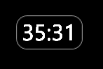
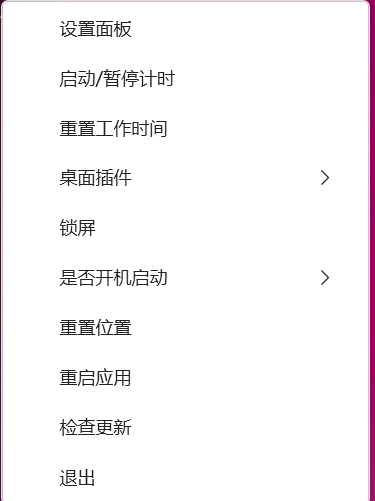
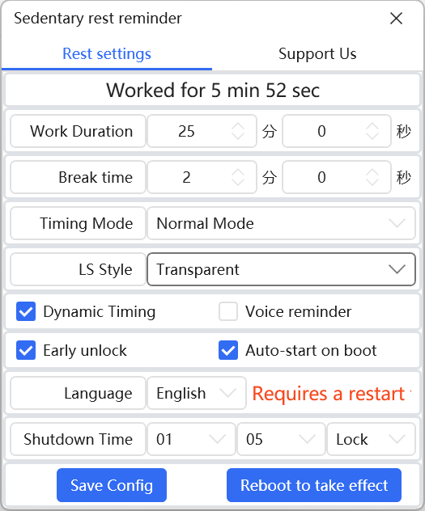
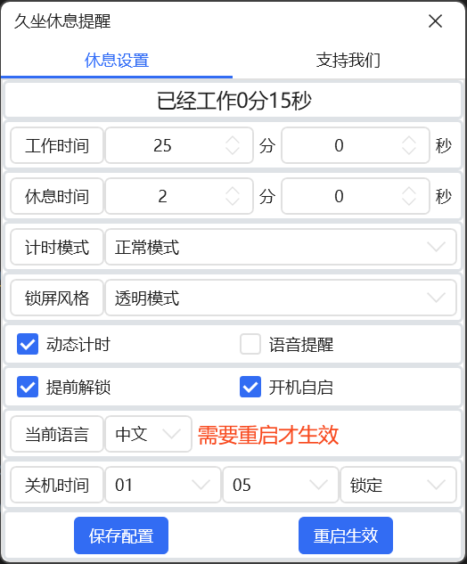

# 🛡️ EyeGuard / SedentaryReminder

> Keep your eyes healthy and your posture in check. A lightweight Windows WPF
> reminder that nudges you to step away from the screen at the right pace.

EyeGuard sits quietly in your system tray and keeps you on a healthy rhythm —
work, then break. It's designed for developers, students, remote workers,
and anyone spending long hours at a keyboard.

---

## 📥 Download

| Channel | Link |
|---|---|
| Microsoft Store (recommended) | [Get it on Microsoft Store](https://apps.microsoft.com/detail/9N9TFRBPRLXZ) |
| GitHub Releases | [Pre-built binaries for x64 / x86](https://github.com/cn-helper/SedentaryReminder/releases) |
| Gitee (Chinese mirror) | [Gitee Releases](https://gitee.com/helpers/SedentaryReminder/releases) |

> GitHub and Gitee releases are framework-dependent — the .NET 8 Desktop Runtime
> must be installed on the target machine. The Microsoft Store edition
> includes it.

---

## ✨ Features

### ⏰ Customizable work / break cycles
Define your own rhythm: e.g. 45 min work → 3 min break. A soft one-minute
pre-break tip warns you before the screen locks so you can wrap up what
you're doing.

### 🎮 Smart activity detection
The timer only runs while mouse or keyboard activity is detected. Idle for
more than 5 minutes and the counter resets — no need to pause manually
every time you step away.

### 🖥️ Multi-monitor aware
When break time starts, every connected display is locked together.

### 🔒 Six lock styles
| Style | What it does |
|---|---|
| Transparent | Screen stays visible, input is blocked |
| Dim | Semi-transparent veil over all windows |
| Screensaver | Full-screen overlay, no input |
| Voice-only | Voice reminder only, screen never locks |
| Windows lock | Native Win + L lock screen |
| Black screen | Pure black with countdown in the center |

### 🎯 Five timer modes
1. **Normal** — continuous timer, break fires every cycle
2. **Smart** — timer runs only while mouse/keyboard active, resets after 5 min idle
3. **Full-screen / Game mode** — pauses while a full-screen app is active; exits full-screen → immediate break
4. **Forced break** — no pre-break tip, no skip, screen locks immediately
5. **Voice / Win+L** — voice prompt or native Windows lock only, no overlay

### 💤 Sleep timer
Set the app to shut down your PC automatically at a fixed time, with a
full-screen one-minute warning so you can cancel if needed.

### 🌍 Multi-language
Built-in **Chinese / English** UI with language switcher in settings.

### 📊 Live statistics
Daily work / break minutes, top hours of the day, active ratio — all
viewable from the tray window.

---

## 🖼️ Screenshots

| | |
|---|---|
| Desktop floating widget | Tray menu |
|  |  |
| Pre-break reminder | Break tip panel |
|  |  |
| Settings panel (EN) | Settings panel (ZH) |
|  |  |

---

## 🖖 Support the project

If EyeGuard helps you stay healthier, a small tip keeps the project going!

 

---

## 🛠️ System requirements

- Windows 10 / 11 (64-bit or 32-bit)
- .NET 8 Desktop Runtime (for GitHub / Gitee releases)
- Microsoft Edge WebView2 Runtime (bundled with most Win11 systems)

---

## 📝 Versioning

Four-segment MAJOR.MINOR.PATCH.REVISION:
- **REVISION = 0** = local dev build (e.g. 1.1.17.0)
- **REVISION > 0** = public release (e.g. 1.1.16.100)

Microsoft Store builds use MAJOR.MINOR.PATCH.0 (4th segment always 0).

---

## 🤝 License & Support

| | |
|---|---|
| License | MIT |
| Issues | File a bug or feature request here on GitHub |
| Gitee mirror | [helpers/SedentaryReminder](https://gitee.com/helpers/SedentaryReminder) |

---

**Keep moving. Keep blinking. 💚**